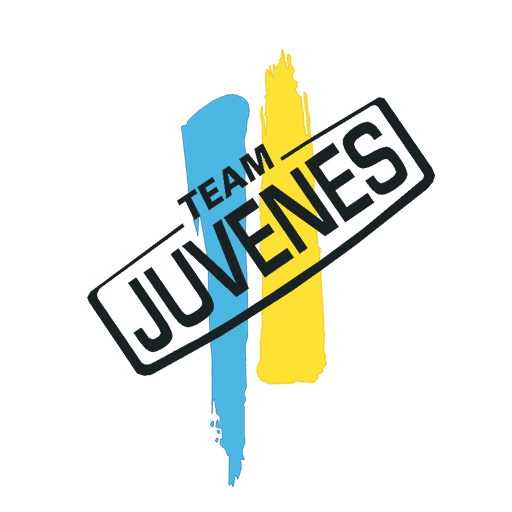
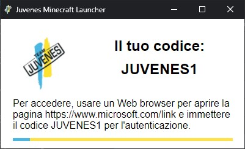

<!-- commented out the old README.md - alba4k; 31.1.2022 -->
<!--
# minecraft-juvenes-launcher

## Requirements:
```
Python 3
Git
Java (suggested: Java 17, jre-openjdk)
```

## Run:
```sh
git clone https://github.com/juvenestech/minecraft-juvenes-launcher
cd minecraft-juvenes-launcher
pip install -r requirements.txt
python app.py
```


## Compile:
```sh
git clone https://github.com/juvenestech/minecraft-juvenes-launcher
cd minecraft-juvenes-launcher
pip install -r requirements.txt
pip install pyinstaller
python -m eel app.py web --onefile --noconsole
```
-->
# **minecraft-juvenes-launcher**

## Requirements:
* [Python 3](https://www.python.org/) or above (running/compiling the source code)
* [Git](https://git-scm.com/) (cloning the repository)
* [Java](https://www.java.com/) (suggested: Java 17)

## Running the source code:
To run the code, first clone the git repository containing it
```sh
git clone https://github.com/juvenestech/minecraft-juvenes-launcher

cd minecraft-juvenes-launcher
```
You will have to install some required python modules:
```sh
pip install -r requirements.txt
```
Now, you can finally run the program:
```sh
python app.py
```

## Compiling the source code:

**Please note that you might not need to compile the program, an already compiled version for your operating system might already be inside of the `dist` directory.**

To compile a python source code, you will first need to install the pyinstaller module:
```sh
pip install pyinstaller
```
Then, clone the git repository:
```sh
git clone https://github.com/juvenestech/minecraft-juvenes-launcher

cd minecraft-juvenes-launcher
```
You can now compile it:
```
python -m eel app.py web --onefile --noconsole
```
At the end of the process, a new file will appear inside of the `dist` directory. It will be named `app.exe` if it got compiled on Windows, `app` if on MacOS or Linux.

## **About**


<!-- Please change this part. Please.-->
### **minecraft-juvenes-launcher** is a custom minecraft launcher developed by [Juvenes APS](https://www.juvenes.it), an italian non-profit corporation that organizes many fun activities mostly pointed at the youth.

<br>



### It allows a pretty fast launch of the well-known game [Minecraft](https://minecraft.net/). The idea behind the making of this project was to ~~Lorem ipsum dolor sit amet, consectetur adipiscing elit. Nunc tempus, dui eget lacinia aliquet, sapien massa elementum sapien, eu accumsan purus turpis eget justo. Sed aliquet sodales feugiat. Phasellus ante.~~ <!-- idk, put something appropriate here -->